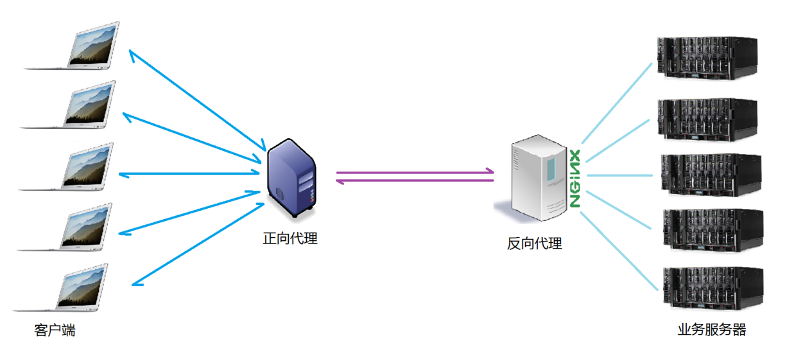
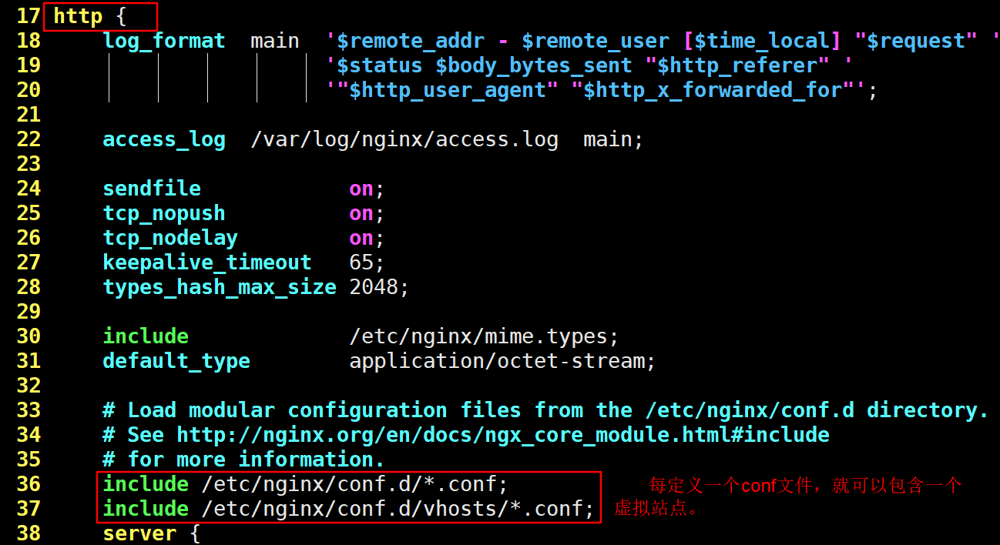
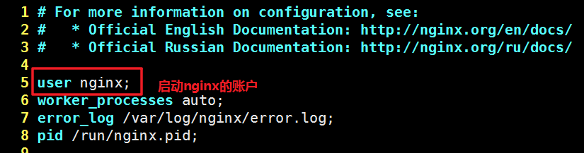

# Nginx的介绍与使用[^1]

### 一、Nginx的相关介绍

*Nginx* (engine x) 是一个高性能的[HTTP](https://baike.baidu.com/item/HTTP)和[反向代理](https://baike.baidu.com/item/反向代理/7793488)web服务器，同时也提供了IMAP/POP3/SMTP[服务](https://baike.baidu.com/item/服务/100571)。Nginx是由伊戈尔·赛索耶夫为[俄罗斯](https://baike.baidu.com/item/俄罗斯/125568)访问量第二的Rambler.ru站点（俄文：Рамблер）开发的，第一个公开版本0.1.0发布于2004年10月4日。

其将[源代码](https://baike.baidu.com/item/源代码)以类BSD许可证的形式发布，因它的稳定性、丰富的功能集、示例配置文件和低系统资源的消耗而[闻名](https://baike.baidu.com/item/闻名/2303308)。2011年6月1日，nginx 1.0.4发布。

Nginx是一款[轻量级](https://baike.baidu.com/item/轻量级/10002835)的[Web](https://baike.baidu.com/item/Web/150564) 服务器/[反向代理](https://baike.baidu.com/item/反向代理/7793488)服务器及[电子邮件](https://baike.baidu.com/item/电子邮件/111106)（IMAP/POP3）代理服务器，在BSD-like 协议下发行。其特点是占有内存少，[并发](https://baike.baidu.com/item/并发/11024806)能力强，事实上nginx的并发能力确实在同类型的网页服务器中表现较好，中国大陆使用nginx网站用户有：百度、[京东](https://baike.baidu.com/item/京东/210931)、[新浪](https://baike.baidu.com/item/新浪/125692)、[网易](https://baike.baidu.com/item/网易/185754)、[腾讯](https://baike.baidu.com/item/腾讯/112204)、[淘宝](https://baike.baidu.com/item/淘宝/145661)等[^2]。

#### 正向代理与反向代理

##### 正向代理

正向代理，意思是一个位于客户端和原始服务器(origin server)之间的服务器，为了从原始服务器取得内容，客户端向代理发送一个请求并指定目标(原始服务器)，然后代理向原始服务器转交请求并将获得的内容返回给客户端。客户端才能使用正向代理。

正向代理的用途：
（1）访问原来无法访问的资源，如Google
（2） 可以做缓存，加速访问资源
（3）对客户端访问授权，上网进行认证
（4）代理可以记录用户访问记录（上网行为管理），对外隐藏用户信息
<font color="red">正向代理最大的特点是客户端非常明确要访问的服务器地址；正向代理模式屏蔽或者隐藏了真实客户端信息。</font>

##### 反向代理

在[计算机网络](https://baike.baidu.com/item/计算机网络)中，**反向代理**是[代理服务器](https://baike.baidu.com/item/代理服务器/97996)的一种。服务器根据客户端的请求，从其关联的一组或多组后端[服务器](https://baike.baidu.com/item/服务器)（如[Web服务器](https://baike.baidu.com/item/Web服务器)）上获取资源，然后再将这些资源返回给客户端，客户端只会得知反向代理的IP地址，而不知道在代理服务器后面的服务器簇的存在。


反向代理的特点：<font color="red">客户端是无感知代理的存在的，反向代理对外都是透明的，访问者并不知道自己访问的是一个代理。因为客户端不需要任何配置就可以访问。反向代理，"它代理的是服务端，代服务端接收请求"，</font>主要用于服务器集群分布式部署的情况下，反向代理隐藏了服务器的信息。

反向代理的作用：
（1）保证内网的安全，通常将反向代理作为公网访问地址，Web服务器是内网
（2）负载均衡，通过反向代理服务器来优化网站的负载

常见的项目场景

### 二、安装[^3]

本教程主要是基于CENTOS7，有两种安装方式，一是基于源码的安装方式，二是使用yum的安装方式，**两种方式安装后的一些目录会不太一样**，在使用时一定要注意。

#### 2.1 准备相关环境

在安装Nginx之前需要确保系统里已经安装好相关环境，包括gcc环境、pcre库（提供正则表达式和Rewrite模块的支持）、zlib库（提供Gzip压缩）、openssl库（提供ssl支持），使用yum直接安装这些依赖环境即可，不需要额外编译：

```shell
yum  install  gcc-c++ pcre  pcre-devel  openssl  openssl-devel  zlib  zlib-devel  -y
```

#### 2.2使用yum安装Nginx

nginx并不在centos的默认库中，需要添加epel扩展源

```shell
yum -y install epel-release		# 添加epel扩展源
yum install -y nginx
```

至此，nginx已经安装完毕，在命令行中输入Nginx，在浏览器中输入本机地址就能看到Nginx的欢迎界面了。

注意：**使用此方法安装的Nginx，它的配置文件目录是/etc/nginx/**

#### 2.3 使用源码安装Nginx

##### 2.3.1 为Nginx创建好用户和用户组

编译时会用上这个信息，后面启动服务时也会指定该用户

```shell
groupadd nginx
useradd -s /sbin/nologin -g nginx nginx
```

#### 2.3.2 下载源码并安装

```shell
cd /usr/local/src 
wget http://nginx.org/download/nginx-1.12.2.tar.gz
tar -zxvf nginx-1.12.2.tar.gz
cd nginx-1.12.2
./configure \
--prefix=/usr/local/nginx \
--user=nginx \
--group=nginx \
--sbin-path=/usr/local/nginx/sbin/nginx \
--conf-path=/usr/local/nginx/conf/nginx.conf \
--error-log-path=/usr/local/nginx/logs/error.log \
--http-log-path=/usr/local/nginx/logs/access.log \
--pid-path=/usr/local/nginx/nginx.pid \
--with-pcre \
--with-http_ssl_module \
--with-http_flv_module \
--with-http_mp4_module \
--with-http_gzip_static_module \
--with-http_stub_status_module
make && make install
```

##### 2.3.3 **Nginx编译安装常用选项解释：**

> --prefix=path：设置Nginx的安装路径，不写的话默认是在/usr/local/nginx
> --sbin-path=path：设置Nginx的可执行文件路径，默认路径是prefix/sbin/nginx
> --conf-path=path：设置Nginx配置文件路径，默认路径是prefix/conf/nginx.conf
> --pid-path=path：设置Nginx pid文件路径，默认路径是prefix/logs/nginx.pid
> --error-log-path=path：设置错误日志存放路径，默认路径是prefix/logs/error.log
> --http-log-path=path：设置访问日志存放路径，默认路径是prefix/logs/access.log
> --user=name：设置运行Nginx的用户，默认用户是nobody
> --group=name：设置运行Nginx的用户组，默认用户组是nobody
> --with-http_ssl_module：启用Nginx的SSL功能
> --with-http_realip_module：该模块可以记录原始客户端的IP而不是负载均衡的IP
> --with-http_sub_module：文字内容替换模块，可用于替换全站敏感字等
> --with-http_flv_module：开启对FLV格式文件的支持
> --with-http_mp4_module：开启对MP4格式文件的支持
> --with-http_gzip_module：提供对gzip压缩的支持
> --with-http_stub_status_module：开启Nginx状态监控模块
>
> --with-pcre：支持正则表达式

注：--with开头的选项通常是开启一些模块，而带有temp的选项一般是执行对应模块时产生的临时文件所存放的路径

注意：此方法安装的Nginx，**配置文件目录是/usr/local/nginx/conf/nginx.conf**

### 三、基本命令

```shell
/usr/local/nginx/sbin/nginx  -t  #检查配置文件是否有错
/usr/local/nginx/sbin/nginx  -v  #查看Nginx版本
/usr/local/nginx/sbin/nginx  -V  #查看Nginx安装时所用的编译选项，使用yum安装的也可以看到
/usr/local/nginx/sbin/nginx  -s  #发送信号，如stop、restart、reload、reopen
/usr/local/nginx/sbin/nginx  -c  #指定其他配置文件来启动nginx
```

conf：存放Nginx配置文件
logs：存放Nginx日志文件存放目录

### 四、配置

#### 4.1 语法

> Nginx的主配置文件由指令与指令块构成，**指令块以{ }大括号将多条指令组织在一起**
> **每条指令以；分号结尾**，指令与参数间用空格分隔
> **支持include语句组合多个配置文件**，提升可维护性
> #表示注释，$表示变量，部分指令的参数支持正则表达式

#### 4.2  在一台主机上配置多站点

##### 4.2.1 创建test.conf文件

因为我们是通过第三方源的方式进行安装，nginx的配置文件将会放入到/etc/nginx/目录下，我们可以在/etc/gninx/conf.d/这个目录下放置我们的站点配置文件，这样就可在一台主机上配置多站点，而且也便于管理。

```shell
cd /etc/nginx/conf.d/
mkdir vhosts
cd vhosts
vim test.conf
```

下面是test.conf的实际内容，注意：listen监听的端口不能冲突。

```shell
server { 
	listen *:8080;	#要监听的端口
	server_name www.test.cn;		#站点别名
	location / {
		root /home/www/Leaflet_Demo;	# 站点文件目录
	}	
}
```

##### 4.2.2 修改/etc/nginx/nginx.conf文件

修改/etc/nginx/nginx.conf文件，在http配置项中将vhosts下的所有conf文件包含进去，如下所示：



##### 4.2.3 修改站点目录的所有者及目录权限

这一步很关键，否则可能会出现 **“403 Forbidden“**的错误[^4]

首先，将nginx.config的user改为和启动用户一致，我们是以nginx用户及nginx用户组来运行的，所以nginx.conf配置如下:



其次， 修改站点目录的所有者及权限

```shell
chown -R nginx:nginx /home/www/Leaflet_Demo 
chmod -R 755 /home/www/Leaflet_Demo
curl localhost:8900	# 此时可以正确的访问站点了
```

最后，将我们的端口加入到防火墙中，这样我们才能进行正常的访问。

```shell
fiewall-cmd --permanent --zone=public --add-port=8900/tcp 		# 要加入的
firewall-cmd --reload
```

#### 4.3 安装uwsgi并进行配置

nginx只支持静态页面的访问，以及作为反向代理。因此，我们要使用python作为后台的编程语言需要将nginx做为反向代理来使用。以下是uwsgi的配置。首先，我们假设有一个django开发的站点名叫dtxt，我们将使用8080端口对站点进行访问，并且项目的代码位于/home/www/dtxt/目录下。

##### 4.3.1安装（略）

##### 4.3.2 编写uwsgi.ini配置文件

在实际环境中，一会将uwsgi的启动参数配置成ini文件，我们可以参照官网来写一个配置文件

```ini
# cd /www/apply/webapp
# vim webapp.ini
[uwsgi]
# Django-related settings
# 应用站点的全路径，注意是全路径
chdir = /home/www/Leaflet_Demo

# Django's wsgi file（Django项目的wsgi文件）
module = webapp.wsgi

# the virtualenv (full path)
# home = /path/to/virtualenv

# process-related settings
# master master = true

# maximum number of worker processes
processes = 5

# the socket (use the full path to be safe)
# 使用socket文件，性能更好，但是，socket文件名及路径必须与nginx中定义的文件名和路径一致
 socket = /home/www/Leaflet_Demo/mysite.sock
# socket = :81
# 直接将uwsgi做为服务器使用，需要写成这样
# http=0.0.0.0:80

# ... with appropriate permissions - may be needed
# 修改socket文件的权限
chmod-socket = 666

# clear environment on exit
vacuum = true

```

这样，我们就可以参数的方式启动我们的uwsgi服务

```shell
uwsgi --ini uwsgi.ini
```

##### 4.3.3 编写我们nginx站点的的配置文件

在这里，我们将从外部的8900端口进行访问，静态请求，如访问的static目录下的文件直接通过nginx直接处理，动态的通过反向代理转发到uwsgi来进行处理

```ini
upstream dtxt {         
    server unix:////home/www/Leaflet_Demo/mysite.sock;       
    #server 127.0.0.1:8001;             
}
server {
    listen 8000 default_server;
    server_name dtxt.25.vm;
    charset utf-8;

    client_max_body_size 75M;

    location / {
        include /etc/nginx/uwsgi_params;
        uwsgi_pass dtxt;
    }

    location /static {
        alias /home/www/Leaflet_Demo/static;
    }
}
```


[^1]:  [Nginx 相关介绍(Nginx是什么?能干嘛?)](https://www.cnblogs.com/wcwnina/p/8728391.html)
[^2]:  [nginx](https://baike.baidu.com/item/nginx/3817705?fr=aladdin)
[^3]:[【Nginx配置教程】Nginx-1.13.10编译安装与配置教程](http://www.linuxe.cn/post-168.html)
[^4]:	[Nginx 出现 403 Forbidden 最终解决方法](https://www.jb51.net/article/121064.htm)

[Nginx 安装与部署配置以及Nginx和uWSGI开机自启](https://www.cnblogs.com/wcwnina/p/8728430.html)