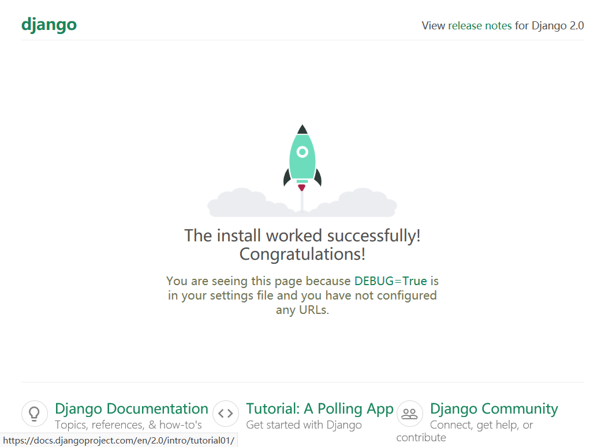

# 使用Docker 部署之进阶_alpine版

　　本文参考了网上的文章：[项目部署：docker-django-nginx-uwsgi-postgres-supervisor](https://blog.csdn.net/qq_36792209/article/details/82778611)、[**django-uwsgi-nginx**](https://github.com/dockerfiles/django-uwsgi-nginx)、[alpine-python3-django-uwsgi-nginx ](https://github.com/Koff/alpine-python3-django-uwsgi-nginx)、[Docker构建nginx+uwsgi+flask镜像（一）](https://www.cnblogs.com/beiluowuzheng/p/10219506.html)、[Docker从alpine构建python3+Django+uwsgi+twisted+Pillow+mysql](https://www.jianshu.com/p/6fa94d6222d2)、[docker-alpine-python3-selenium](https://www.jianshu.com/p/59034b414a5e)

　　前面，我们完成了使用ubuntu的镜像完成了部署的工作（《使用Docker进行部署_ubuntu1804》），但是，在部署中我发现存在几个问题：一、生成的镜像比较大，有600多M，所以这次我们采用体积更小的apline镜像作为基础镜像; 二、生成的过程非常慢，一小点改动要重新生成镜像会非常的耗时。在这篇文章中我们将主要解决上述的问题，并做一些测试与改动，如将代码和日志都放在宿主机上，通过卷映射的方式来使用，这样我们在开发时修改代码就不必每次重新生成镜像了。

　　还是按上一篇文章的方式，进行一些铺垫。

### 一、环境介绍

#### 1、宿主机 

> 系统：centos7 64位
> django 项目在宿主机中目录：/home/mysite
> dockerfile所在的目录：/home/mysite/docker

项目名称：mysite(所以项目代码的全路径是/home/mysite)

#### 2、docker容器工作目录

容器的工作目录：

/data/apps/mysite 
/data/tmp/sock 
/data/tmp/pid 
/data/logs/uwsgi 
/data/logs/nginx

#### 4、项目及Dockerfile文件目录树展示

```shell
[root@localhost mysite]# pwd
/home/mysite
[root@localhost mysite]# tree -L 3
.
├── db.sqlite3
├── docker
│   ├── Dockerfile
│   ├── Dockerfile1
│   ├── mysite_nginx.conf
│   ├── nginx.conf
│   ├── supervisord.conf
│   └── uwsgi.ini
├── manage.py
├── mysite
│   ├── __init__.py
│   ├── __pycache__
│   │   ├── __init__.cpython-36.pyc
│   │   ├── settings.cpython-36.pyc
│   │   ├── urls.cpython-36.pyc
│   │   └── wsgi.cpython-36.pyc
│   ├── settings.py
│   ├── urls.py
│   └── wsgi.py
├── requirements.txt
├── static
│   └── admin
│       ├── css
│       ├── fonts
│       ├── img
│       └── js
└── todo.md
```

### 二、准备项目文件

在Docker封装之前，在/home目录

##### 2.1 创建项目

```shell
pip install django
cd /home/
django-admin startproject mysite
cd mysite
```

> ##### 关于项目目录
>
> manage.py 文件所在位置为项目目录，如本文中的`/home/mysite/`。

##### 2.2 部署静态文件及配置数据库

###### 2.2.1 修改settings.py文件

修改 /home/mysite/mysite文件夹下 settings.py 文件中的ALLOWED_HOSTS配置项，不修改该值的话在启动django项目时会报错DisallowedHost at / Invalid HTTP_HOST ...

```python
ALLOWED_HOSTS = ['*', 'ip'] # ip为你所使用的IP，可自行修改, `*`代表允许所有的ip
```

###### 2.2.2 收集态文件集中到static文件夹中

在运行nginx之前，要把Django的静态文件集中到static文件夹中。在 /home/mysite/mysite/settings.py文件末尾加入:

```python
STATIC_ROOT = os.path.join(BASE_DIR, "static/")
```

在项目目录下：

```shell
cd /home/mysite
python manage.py collectstatic
```

###### 2.2.3 配置数据库

```python
DATABASES = {
    'default': {
        'ENGINE': 'django.db.backends.mysql',
        'NAME': "你的数据库名",
        'USER': "数据库账户",
        'PASSWORD': "登录密码",
        'HOST': "192.168.XXX.XXX",
        'PORT': "3306",
    }
}
```

### 三、制作基础镜像

　　在制作的过程中我发现，其实我们可以将python3、uwsgi、nginx制作成一个基础镜像，将我们要使用的django、要要使用的python包及我们的配置文件放到第二个镜像中制作，这样会大大的加速我们的制作速度，为了减少镜像的大小，我们采用了alpine:latest镜像作为基础镜像。下面是我们制作python3、uwsgi、nginx基础镜像的Dockerfile文件：

```shell
# 配置基础镜像
FROM alpine:latest

# 添加标签说明
LABEL author="mgj" email="gztf@21cn.com"  purpose="python3 uwsgi nginx supervisor in a image"

# 配置清华镜像地址
RUN echo "https://mirror.tuna.tsinghua.edu.cn/alpine/v3.8/main/" > /etc/apk/repositories

# 设置用户
USER root

# 设置时区变量
ENV LANG C.UTF-8
ENV TIME_ZONE Asia/Shanghai

#安装时区包并配置时区TIME_ZONE为中国标准时间
RUN apk add --no-cache -U tzdata \
    && ln -sf /usr/share/zoneinfo/${TIME_ZONE} /etc/localtime \ 
    && echo "${TIME_ZONE}" > /etc/timezone 

# 更新升级软件
RUN apk add --update --upgrade \
    vim    

# 安装软件python3,升级pip,setuptools,安装nginx supervisor uwsgi
RUN apk add --no-cache bash python3 gcc make libc-dev linux-headers pcre-dev jpeg-dev zlib-dev mariadb-dev libffi-dev python3-dev nginx supervisor \    
    && python3 -m ensurepip \
    && rm -r /usr/lib/python*/ensurepip \
    && pip3 install --default-timeout=100 --no-cache-dir --upgrade pip -i https://pypi.douban.com/simple \
    && pip3 install --default-timeout=100 --no-cache-dir --upgrade setuptools -i https://pypi.douban.com/simple \
    && pip3 install --default-timeout=100 --no-cache-dir --upgrade uwsgi -i https://pypi.douban.com/simple \
	&& mkdir -p /run/nginx/ \
    && rm -rf /var/cache/apk/* \
    && rm -rf ~/.cache/pip


# 设置启动点 镜像启动时的第一个命令, 通常 docker run 的参数不会覆盖掉该指令
ENTRYPOINT [ "/bin/sh" ]

# 配置非生效对外端口
EXPOSE 80

# 设置启动时预期的命令参数, 可以被 docker run 的参数覆盖掉.
# CMD [ "/bin/sh" ]
```
构建镜像

```shell
docker build -t alpine_py3_uwsgi_nginx:v1 .
```

**<font color=red>注意：</font>** 有几个包是需要安装的，分别是`jpeg-dev zlib-dev mariadb-dev libffi-dev`,如果不安装，在安装django及mysql所需要的包时会出错。并且还要安装`bash`,否则不能使用sh进入容器的命令行。

**<font color=red>注意：</font>** 在镜像中我加入了`ENTRYPOINT [ "/bin/sh" ]`，所以进入启动容器进入命令行的格式是：

```shell
docker run --name webapp -it -p 8080:80 alpine_py3_uwsgi_nginx:v1
```

我曾经使用加了`/bin/sh`参数的命令行，得到如下错误：

```shell
docker run --name webapp -it -p 8080:80 alpine_py3_uwsgi_nginx:v1 /bin/sh
/bin/sh: line 1:ELF: not found
/bin/sh: line 2: p: not found
/bin/sh: line 3: p: not found
/bin/sh: line 1: t
                  : not found
/bin/sh: line 1:  
                 ʺ not found
/bin/sh: line 1: D ¢
                     ²
                       ²
                       Q䳤R䳤: not found
/bin/sh: line 1:  
                 : not found
/bin/sh: line 4: 񕸁 
                  t
                    
                    : not found
/bin/sh: line 4:  : not found
L@DImnstuxyz: not foundd-musl-x86_64.so.1mª!R
/bin/sh: line 1: ᯏ镳: not found
/bin/sh: line 1: 𔸠not found
/bin/sh: line 1: MZº¼!9!di9WۓŹ@9򉝀³񒐯ӡ²¢񐵕e
                                        ݣk: not found
/bin/sh: line 1: ϥͭgUa: not found
/bin/sh: line 6: ~씯¸󳅷: not found
/bin/sh: line 7:  
                 ¤: not found
/bin/sh: line 8: ¢¨: not found
/bin/sh: line 46: syntax error: unexpected ")"

```

**<font color=red>注意：</font>** 如果容器是已经启动了的，进入容器命令行的格式又有不同：

```shell
docker exec -it webapp /bin/sh
```

### 四、准备制作镜像的文件

#### 4.1 准备uwsgi.ini文件

在目录`/home/mysite/docker`中新建uwsgi.ini文件，内容如下：

```ini
# uwsgi.ini file
[uwsgi]

# Django-related settings
# the base directory (full path)
chdir           = /data/apps/mysite
# Django's wsgi file
module          =  mysite.wsgi:application

# the virtualenv (full path)，使用docker不需要使用虚拟环境了
#home            = /usr/src/app
# process-related settings
# master
master          = true
# maximum number of worker processes
processes       = 4
# the socket (use the full path to be safe
socket          = /data/tmp/sock/mysite.sock

pidfile 		= /data/tmp/pid/mysite.pid
# ... with appropriate permissions - may be needed
chmod-socket    = 666
# clear environment on exit
vacuum          = tru
```

**<font color=red>注意：</font>** chdir与module的配置项一定要写对，并且 socket配置项一定要与nginx中的一致。

#### 4.2准备nginx 文件

**<font color=red>注意：</font>** 因为alpine中使用`apk add`安装nginx会与ubuntu中的默认配置不太一样，所以我们准备了nginx.conf来代替默认的nginx.conf，在目录`/home/mysite/docker`中新建nginx.conf文件代码如下：

```ini
# /etc/nginx/nginx.conf

user nginx;

# Set number of worker processes automatically based on number of CPU cores.
worker_processes auto;

# Enables the use of JIT for regular expressions to speed-up their processing.
pcre_jit on;

# Configures default error logger.
error_log /data/logs/nginx/error.log warn;

# Includes files with directives to load dynamic modules.
include /etc/nginx/modules/*.conf;


daemon off;
pid /data/tmp/pid/nginx.pid;


events {
	# The maximum number of simultaneous connections that can be opened by
	# a worker process.
	worker_connections 1024;
}

http {
	# Includes mapping of file name extensions to MIME types of responses
	# and defines the default type.
	include /etc/nginx/mime.types;
	default_type application/octet-stream;

	# Name servers used to resolve names of upstream servers into addresses.
	# It's also needed when using tcpsocket and udpsocket in Lua modules.
	#resolver 208.67.222.222 208.67.220.220;

	# Don't tell nginx version to clients.
	server_tokens off;

	# Specifies the maximum accepted body size of a client request, as
	# indicated by the request header Content-Length. If the stated content
	# length is greater than this size, then the client receives the HTTP
	# error code 413. Set to 0 to disable.
	client_max_body_size 75m;

	# Timeout for keep-alive connections. Server will close connections after
	# this time.
	keepalive_timeout 65;

	# Sendfile copies data between one FD and other from within the kernel,
	# which is more efficient than read() + write().
	sendfile on;

	# Don't buffer data-sends (disable Nagle algorithm).
	# Good for sending frequent small bursts of data in real time.
	tcp_nodelay on;

	# Causes nginx to attempt to send its HTTP response head in one packet,
	# instead of using partial frames.
	#tcp_nopush on;


	# Path of the file with Diffie-Hellman parameters for EDH ciphers.
	#ssl_dhparam /etc/ssl/nginx/dh2048.pem;

	# Specifies that our cipher suits should be preferred over client ciphers.
	ssl_prefer_server_ciphers on;

	# Enables a shared SSL cache with size that can hold around 8000 sessions.
	ssl_session_cache shared:SSL:2m;


	# Enable gzipping of responses.
	#gzip on;

	# Set the Vary HTTP header as defined in the RFC 2616.
	gzip_vary on;

	# Enable checking the existence of precompressed files.
	#gzip_static on;


	# Specifies the main log format.
	log_format main '$remote_addr - $remote_user [$time_local] "$request" '
			'$status $body_bytes_sent "$http_referer" '
			'"$http_user_agent" "$http_x_forwarded_for"';

	# Sets the path, format, and configuration for a buffered log write.
	access_log /data/logs/nginx/access.log main;


	# Includes virtual hosts configs.
	# include /etc/nginx/conf.d/*.conf;

	include /etc/nginx/sites-available/default/*.conf;
}
```
#### 4.3、准备my_nginx.conf文件

在目录`/home/mysite/docker`中新建my_nginx.conf文件代码如下：

```ini
# mysite_nginx.conf

# the upstream component nginx needs to connect to
upstream mysite {
    # server unix:///path/to/your/mysite/mysite.sock; # for a file socket
    #server 127.0.0.1:8001; # for a web port socket (we'll use this first)
    server unix:///data/tmp/sock/mysite.sock;       # 必需与uwsgi.ini中定义的一致
}
# configuration of the server
server {
    # the port your site will be served on
    listen      80 default_server;
    # the domain name it will serve for
    server_name localhost; # substitute your machine's IP address or FQDN
    charset     utf-8;

    # max upload size
    client_max_body_size 75M;   # adjust to taste

#   Django media
    location /media  {
       alias /data/apps/mysite/media;  # 你的 Django 项目media files路径 - amend as required
    }

    location /static {
       alias /data/apps/mysite/static; # 你的 Django 项目 static files路径 - amend as required
    }

    # Finally, send all non-media requests to the Django server.
    location / {
        uwsgi_pass  mysite;
        include     /etc/nginx/uwsgi_params; # the uwsgi_params file you installed
    }
}
```

**<font color=red>注意：</font>** 

- socket要与uwsgi.ini中定义的一致
- /static的路径要全路径
- 因为要作为 default_server，所以这个文件在容器中是copy到`/etc/nginx/sites-available/default`目录中的

#### 4.4 准备supervisord.conf文件

在目录`/home/mysite/docker`中新建supervisord.conf文件，内容如下：

```ini
[supervisord]
[program:app-uwsgi]
command = /usr/bin/uwsgi --ini /data/apps/uwsgi.ini

[program:nginx-app]
command = /usr/sbin/ngin
```

#### 4.5 制作Dockerfile文件

在目录`/home/mysite/docker`中新建Dockerfile文件，内容如下：

```shell
# 制作 django_uwsgi_nginx一体的镜像
# 参考：https://blog.csdn.net/qq_36792209/article/details/82778611   https://blog.csdn.net/qq_31325495/article/details/88891525
# 预定义的目录 /data/apps/mysite /data/tmp/sock /data/tmp/pid /data/logs/uwsgi /data/logs/nginx

FROM alpine_py3_uwsgi_nginx:v1

MAINTAINER gdlmo <gytlgac@163.com>

# 设置用户
USER root

RUN mkdir -p /data/apps/mysite /data/tmp/sock /data/tmp/pid /data/logs/uwsgi \
			/data/logs/nginx /data/logs/supervisor /etc/nginx/sites-available/default \
			/etc/supervisor/conf.d/

WORKDIR /data/apps/mysite

COPY ./ ./

RUN pip3 install  --default-timeout=100 --no-cache-dir -r /data/apps/mysite/requirements.txt -i https://pypi.douban.com/simple \	
	&& cp ./docker/nginx.conf /etc/nginx/nginx.conf \
	&& cp ./docker/my_nginx.conf /etc/nginx/sites-available/default \
	&& cp ./docker/supervisord.conf /etc/supervisor/conf.d/ \
	&& cp ./docker/uwsgi.ini ../ \
	&& rm -rf ./docker

EXPOSE 80
# CMD ["/usr/bin/supervisord", "-n", "-c", "/etc/supervisor/conf.d/supervisord.conf"]
ENTRYPOINT ["/usr/bin/supervisord",  "-n", "-c", "/etc/supervisor/conf.d/supervisord.conf"]
```

**<font color=red>注意</font>**

- 基础镜像是我们前面制作好的alpine_py3_uwsgi_nginx:v1

- 比在基于ubuntu镜像的mkdir中多一个`/etc/nginx/sites-available/default`,alpine镜像中没有这个目录

- 开始我使用`CMD ["/usr/bin/supervisord", "-n", "-c", "/etc/supervisor/conf.d/supervisord.conf"]`，启动镜像时，总会出现如下错误

  > /usr/bin/supervisord: line 3: __requires__: not found
  > /usr/bin/supervisord: line 4: import: not found
  > /usr/bin/supervisord: line 5: import: not found
  > /usr/bin/supervisord: line 6: from: not found
  > /usr/bin/supervisord: line 9: syntax error: unexpected "(" (expecting "then")

  而使用`ENTRYPOINT ["/usr/bin/supervisord, "-n" "-c", "/etc/supervisor/conf.d/supervisord.conf"]`则不会出现错误

- supervisord加入了-n参数，否则会自动退出容器，也可以在supervisord.conf中加入`nodaemon=true`

### 五、开始制作

#### 5.1执行制作命令

在项目目录下`/home/mysite`执行命令，而不是在Dockerfile文件所在的目录（`/home/mysite/docker`）

```shell
cd /home/mysite
docker build -f docker/Dockerfile -t django:v1 .
```

　　为什么要在项目目录下执行呢，我个人的习惯是将与项目有关的资料、执行脚本等都放到项目目录下，以便后期通过项目就可以知道项目期间还做了哪些工作，所以将制作镜像的Dockerfile放到了项目的docker目录下，如果是在Dockerfile所在的目录执行build命令，会出现一个错误：Forbidden path outside the build context  ..[^1]

#### 5.2 运行容器

```shell
docker run --name webapp -d -p 8080:80 django:v1  # 8080是你宿主机对外提供的端口，防火墙要放行
```

通过浏览器就可以看到熟悉的界面了



如果，要将宿主机上的代码映射到容器中，可以使用下面的代码：

```shell
docker run --name webapp -it -p 8080:80 -v /home/mysite/:/data/apps/mysite --privileged=true django:v1 # /home/mysite是你的宿主机上的代码所在路径
```

**<font color=red>注意</font>**

> --privileged=true 是必需的，否则会出现`Permission denied`的错误提示。

### 六、一些补充

#### 6.1、制作镜像的脚本

为了方便各个应用程序能快速的构建镜像，我特意制作了一个脚本`dockerbuild.sh`，以便快速构建。

```shell
# !/bin/bash
filenames=('uwsgi.ini' 'Dockerfile' 'my_nginx.conf' )

# 获取项目名称
projectname=${PWD##*/}

# 修改对应的制作镜像所需要的文件，将mysite替换成项目名称
for filename in ${filenames[@]};do
    echo $filename
    if grep "mysite" ./docker/$filename >/dev/null 2>&1;then
        sed -i "s/mysite/$projectname/g" ./docker/$filename
    fi    
done

# 构建镜像
docker build -f ./docker/Dockerfile -t $projectname:v1 .

# 还原成原样以备其它项目引用
for filename in ${filenames[@]};do
    echo $filename
    if grep $projectname ./docker/$filename >/dev/null 2>&1;then
        sed -i "s/$projectname/mysite/g" ./docker/$filename
    fi    
done
```

在项目目录下使用

```shell
sh dockerbuild.sh
```

#### 6.2、docker命令的别名

将下面的语句加入到`~/.bashrc`文件尾部

```shell
alias cls='clear'
alias dcr='docker rm '		# 删除所指定的容器
alias dpa='docker ps -a' 	# 查看所有容器的状态
alias dre='docker rm $(docker ps -qf status=exited)'	# 删除exited状态的容器
alias di='docker images'	# 列出所有镜像
```

```shell
source ~/.bashrc	# 使别名生效
```


[^1]: [docker 创建镜像时显示 Forbidden path outside the build context](https://www.cnblogs.com/saving/p/10401723.html)

